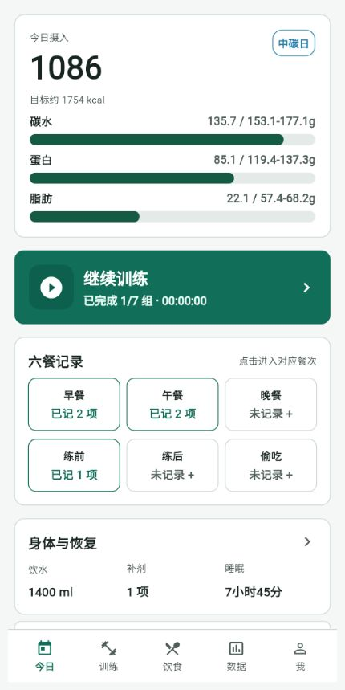
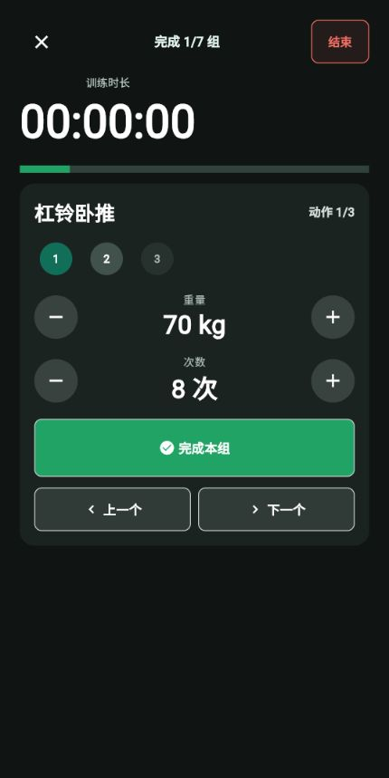
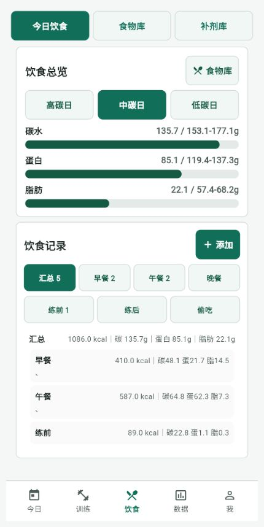
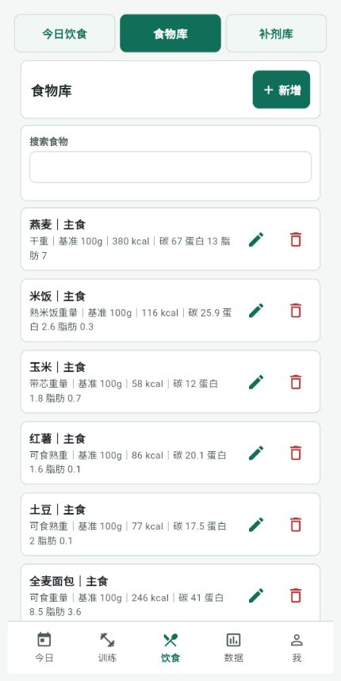
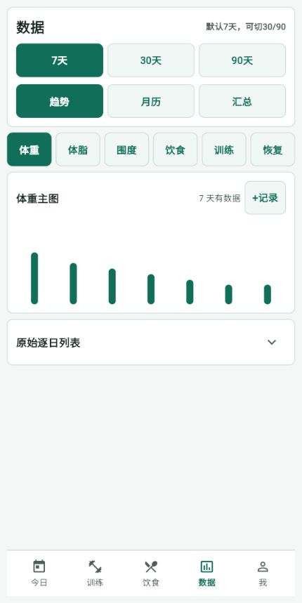
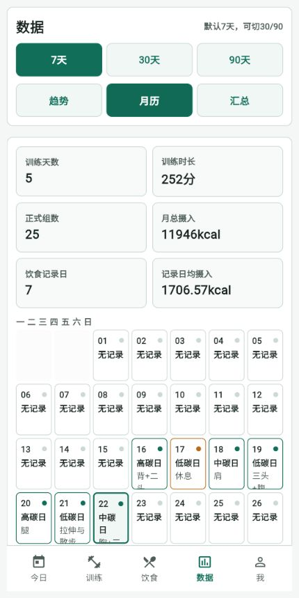
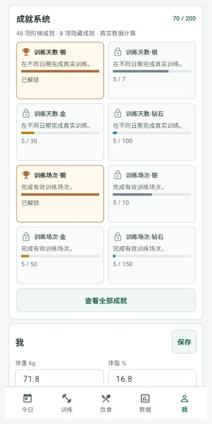

# 碳水大王

面向个人健身记录的 Android 应用，将碳循环饮食、力量训练、身体与恢复数据放进同一套每日记录中。默认打开今日页面，可独立进入训练、饮食、数据和个人页面。

- 当前版本：**v50 / 1.2.0 / Build 50**
- Android 包名：`com.chenyang.carbs_king`
- 框架：Flet `0.85.3`

[](https://github.com/fivespeedbuck/carbs-king/releases/download/v50/carbs_king-v50.apk)

[查看 v50 Release 与更新说明](https://github.com/fivespeedbuck/carbs-king/releases/tag/v50)

## 项目定位

碳水大王用于持续记录一套真实可执行的健身计划，而不是只保存零散数字：

- 根据身体资料和训练部位安排高碳、中碳、低碳日。
- 在早餐、午餐、晚餐、练前、练后和偷吃六个餐次中记录饮食。
- 逐动作、逐组记录重量和次数，并管理组间休息。
- 汇总体重、体脂、围度、饮食、训练、饮水、补剂和睡眠数据。
- 通过趋势、月历、汇总和成就系统查看长期执行情况。

应用仅供个人健身记录和训练规划，不替代医生、营养师或康复专业人员的建议。

## 界面预览

以下图片来自 **v50 实际运行界面**，使用隔离的无隐私中文演示数据，以约 `430 × 860` 的移动视口截取。

| 今日总览 | 当前训练 |
| --- | --- |
|  |  |

| 今日饮食 | 食物库 |
| --- | --- |
|  |  |

| 数据趋势 | 训练月历 |
| --- | --- |
|  |  |

| 成就与个人资料 |
| --- |
|  |

## 核心能力

### 今日与碳循环

- 默认打开今日总览，集中显示当日摄入、宏量营养进度、训练状态和恢复摘要。
- 支持高碳、中碳、低碳目标，以及碳水、蛋白质、脂肪目标区间。
- 可自动计算或自定义三类碳日的宏量倍数。
- 固定联动规则：背或腿训练为高碳，胸或肩训练为中碳，手臂、腹部、有氧或明确休息为低碳；复合训练按高、中、低优先级判断。
- “休息”和“没有记录”分开处理，不会把漏记误判成休息日。

### 训练

- 内置 106 个训练动作，支持按部位筛选，并按名称、器械和目标肌群搜索。
- 动作详情包含目标肌群、动作要点和常见错误。
- 支持逐组重量、次数、完成状态、RIR/RPE、撤销完成和训练总结。
- 支持同一天保存多场训练，以及复用历史复合训练组合。
- 动作库可按常练、最近和名称排序，练过的动作可优先显示。
- 组间休息支持 `-10 秒`、`+10 秒`、暂停/继续和跳过。
- 训练结束统一二次确认，避免误触丢失尚未完成的训练。

### 饮食与补剂

- 六个固定餐次：早餐、午餐、晚餐、练前、练后、偷吃。
- 饮食页包含“今日饮食 / 食物库 / 补剂库”三个互斥视图。
- 食物库记录单位、基准数量、计量口径、热量和三大营养素，可新增和编辑。
- 补剂库与饮食放在同一页面；恢复页面只展示当天实际补剂记录。
- 当日汇总直接对照宏量目标区间，减少在多个页面之间来回查看。

### 数据与月历

- 数据页提供“趋势 / 月历 / 汇总”，趋势支持最近 `7 / 30 / 90` 天。
- 身体、饮食、训练、恢复分类一次只展示一个主图，避免页面信息过载。
- 支持体重、体脂和围度快捷记录；沿用值不会伪装成新的趋势采样点。
- 训练统计包含周总组数、周总容量、动作趋势、分部位最好成绩和 Epley 估算 1RM。
- 月历按天标记碳日、训练部位组合、休息或自定义事项，并展示选中日期详情。

### 身体与恢复

- 记录体重、体脂、腰围和臂围，并计算 BMR/TDEE 与建议热量目标。
- 体重和体脂可分别标记为本次实测，围度独立记录。
- 记录每日饮水、补剂、入睡时间、起床时间和小睡。
- 恢复数据与训练、饮食使用同一日期口径，便于在趋势和汇总中对照。

### 成就系统

- 共 **200 个解锁节点**：48 条铜/银/金/钻石阶梯成就，加 8 项隐藏成就。
- 进度由真实训练、饮食、饮水、睡眠和身体记录计算。
- 不设置鼓励超长训练、一日多练或连续无休训练的不健康条件。

## Android 安装与覆盖更新

1. 下载 [carbs_king-v50.apk](https://github.com/fivespeedbuck/carbs-king/releases/download/v50/carbs_king-v50.apk)。
2. 在 Android 中允许当前文件管理器或浏览器“安装未知应用”。
3. 打开 APK 并安装。已有旧版时，请直接覆盖安装，**不要先卸载旧版**。
4. 首次使用休息提醒时，根据系统提示允许通知和精确闹钟权限。

覆盖更新需要同时满足：包名相同、签名证书相同、Build 不低于已安装版本。官方 v50 使用固定备份密钥签名，包名保持为 `com.chenyang.carbs_king`。

> v50 已完成自动化测试、APK 签名与结构检查，但尚未声明完成 iQOO 11S 真机最终验收。OriginOS 的后台限制、覆盖安装后的数据保留和锁屏提醒仍应以实际手机测试结果为准。

## 休息提醒与系统边界

v50 使用 Android 原生 `BroadcastReceiver + AlarmManager` 调度组间休息提醒：

- 正常情况下可在锁屏、应用退到后台或应用进程被系统回收后发送通知。
- 通知声音和振动遵守 Android 的静音、勿扰模式及通知渠道设置。
- 如果用户主动“强行停止”应用，Android 会禁止该应用已安排的闹钟；重新打开应用后才能恢复后续调度。
- v50 不包含手机重启后的未完成提醒恢复机制。
- OriginOS 等系统的电池优化策略可能影响实际准时性，建议允许通知、精确闹钟，并根据真机情况调整后台电量管理。

## 数据持久化与备份

- Android 数据保存在 Flet 提供的 `FLET_APP_STORAGE_DATA` 持久化目录中。
- 使用相同包名和签名直接覆盖更新时，系统通常会保留应用数据；卸载应用会删除其私有数据。
- “我”页面支持导出完整备份或分类 JSON。
- 导入支持“合并”和“覆盖”；执行导入前会在本地自动创建安全快照。
- 建议在安装新版本、重置手机或调整训练计划前导出一次完整备份，并把备份文件保存到应用私有目录之外。

## 开发运行

### 环境

- Python `>= 3.12`
- Flet `0.85.3`
- Windows PowerShell（APK 构建脚本）
- Android 构建所需的 Flet、Flutter、Gradle 和 JDK 环境

安装依赖并运行：

```powershell
python -m pip install -e .
flet run
```

开发或截图时建议使用隔离数据目录，避免接触真实应用数据：

```powershell
$env:FLET_APP_STORAGE_DATA = "$PWD\.local-demo-data"
$env:CARBS_KING_DATA_DIR = $env:FLET_APP_STORAGE_DATA
flet run
```

设置 `CARBS_KING_DATA_DIR` 后不会执行旧数据目录迁移，适合自动化测试和演示环境。

## 测试与质量

v50 发布候选的最终检查结果：

- `131 passed`
- `408 subtests passed`
- Python 语法编译检查通过
- Git 差异格式检查通过
- `430 × 860` 五个主页面和关键弹窗截图验收通过
- APK 包名、`arm64-v8a` 架构、v2 签名和 ZIP 对齐检查通过

运行完整测试：

```powershell
python -m pytest -q
python -m compileall -q src tests
```

自动化测试不能替代 Android 真机对通知权限、锁屏、静音/勿扰、系统进程回收和厂商电池策略的验证。

## APK 构建

Windows 下可以运行：

```powershell
.\build_apk_update.ps1
```

也可以双击 `build_apk_fast.bat`。脚本会：

- 使用 `pyproject.toml` 中的版本号和 Build。
- 固定包名为 `com.chenyang.carbs_king`。
- 优先使用项目专属的备份签名密钥。
- 构建成功后把 `pyproject.toml` 中的 Build 自动加一，为下次更新做准备。

当前正式版本配置为 `1.2.0 / Build 50`。发布新包前应同时核对版本号、Build、更新日志和 Release 文件名。

## 目录结构

```text
carbs-king/
├─ src/                         Flet 应用、训练/分析/成就等业务模块
│  └─ assets/rest_bell.wav      离线休息提示音
├─ android/rest_alarm_plugin/   Android 原生休息闹钟插件
├─ tests/                       单元、集成、存储隔离与 UI 契约测试
├─ docs/screenshots/            README 使用的真实运行截图
├─ assets/                      应用图标等打包资源
├─ pyproject.toml               依赖、包名、版本与 Android 权限配置
├─ build_apk_update.ps1         固定签名的 APK 构建脚本
├─ CHANGELOG.md                 版本更新记录
└─ README.md                    用户与开发说明
```

## 版本与 Release

- [v50 Release](https://github.com/fivespeedbuck/carbs-king/releases/tag/v50)
- [v50 APK 直接下载](https://github.com/fivespeedbuck/carbs-king/releases/download/v50/carbs_king-v50.apk)
- [完整更新记录](CHANGELOG.md)
- [全部 GitHub Releases](https://github.com/fivespeedbuck/carbs-king/releases)

## 签名密钥注意事项

项目当前使用固定备份的 Android Debug 证书签名，密钥位置为：

```text
%USERPROFILE%\.carbs_king_signing\debug.keystore
```

请把该文件安全地离线备份，不要提交到 Git，也不要公开传输。密钥丢失或更换后，新 APK 将无法覆盖安装现有版本，只能卸载旧应用后重新安装，旧应用私有数据也可能因此丢失。
