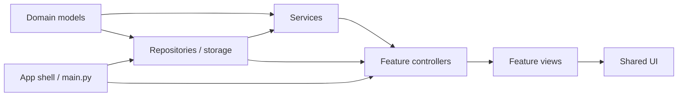
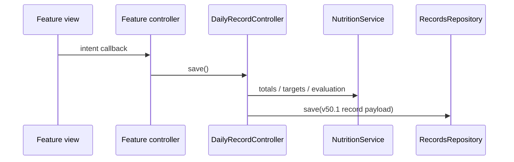
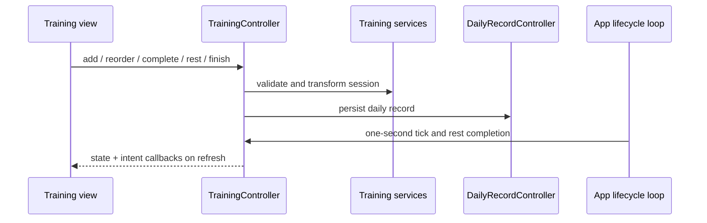

# Carbs King Architecture

This document defines the v50.1 module boundaries. The refactor preserves the
existing JSON formats, visible text, layout, interactions, and version number.

## Layering

Dependencies point to the right/down only. In particular:

- Views never import `main`, read JSON, or persist data.
- Services never import Flet or feature views.
- Controllers own feature state transitions and call repositories/services.
- `main.py` owns startup, dependency assembly, routing, navigation, and the
  one-second active-training lifecycle loop.

## State Ownership

`AppState` is the only mutable runtime state root. Its typed sections are:

| State | Owner |
| --- | --- |
| `ProfileState` | `ProfileController` |
| `DailyState.meals` | `DietController` |
| `DailyState.training` / `TrainingUiState` | `TrainingController` |
| `DailyState.water/sleep/supplements` | `RecoveryController` |
| `DailyState.measurement/circumference` | `DataRecordController` |
| `NavigationState` | app shell and navigation service |
| `DataPageData` | `DataRecordController` |

The `MutableMapping` API on `AppState` is an adapter for the established v50.1
field names. It maps directly to typed fields and does not duplicate state.

## Persistence

- `repositories.py` defines repository contracts and JSON-backed adapters.
- `storage_service.py` owns update-safe paths and atomic JSON compatibility.
- `daily_record_controller.py` is the sole daily-record serializer/loader and
  preserves the legacy record schema and training migration behavior.
- `backup_service.py` validates, snapshots, merges/replaces, and applies backup
  payloads without importing Flet.
- Feature views and `main.py` do not write JSON directly.

Daily save flow:

Training event flow:

## Module Responsibilities

| Feature | Controllers / services | Views |
| --- | --- | --- |
| App shell | `main.py`, `app_context.py`, `controller_runtime.py` | `navigation_views.py` |
| Today | `today_controller.py`, `daily_record_controller.py`, `nutrition_service.py` | `today_views.py` |
| Diet | `diet_controller.py`, `diet_service.py` | `diet_views.py` |
| Recovery | `recovery_controller.py` | feature forms remain local to the controller |
| Training | `training_controller.py`, `training_service.py`, `training_experience_service.py`, `training_clock_service.py`, `training_models.py` | `training_plan_views.py`, `training_picker_views.py`, `training_views.py`, `training_summary_views.py` |
| Profile | `profile_controller.py`, `nutrition_service.py` | `profile_details_views.py`, `profile_macro_views.py`, `profile_backup_views.py`, `profile_views.py` |
| Backup | `backup_controller.py`, `backup_service.py` | backup panel in `profile_backup_views.py` |
| Analytics | `data_record_controller.py`, `analytics_service.py`, `analytics_model.py` | `analytics_page.py`, `analytics_trend_views.py`, `analytics_weekly_review_views.py`, `analytics_calendar_views.py`, `analytics_summary_views.py`, `analytics_ui.py` |
| Achievements | `achievement_service.py`, `achievement_definitions.py` | `achievement_views.py`, `profile_views.py` |
| Shared forms/UI | none | `form_views.py`, `ui_components.py` |
| Rest alert | `rest_notification.py`, Android plugin | active rest controls in `training_views.py` |

`analytics_views.py` is a thin public import facade. It contains no
implementation and keeps existing callers compatible while new work targets
the specific analytics module.

## Parallel Ownership

Agents must use mutually exclusive write sets. Only the integration owner edits
`main.py`, `app_context.py`, or shared state/repository contracts.

| Workstream | Write ownership |
| --- | --- |
| Training | `training_controller.py`, `training_*views.py`, `training_*service.py`, `training_models.py`, matching tests |
| Profile / backup | `profile_controller.py`, `profile_*views.py`, `backup_*.py`, matching tests |
| Analytics / records | `analytics_*.py`, `data_record_controller.py`, matching tests |
| Today / diet / recovery | corresponding controller, service, view, and matching tests |
| Integration | `main.py`, `app_state.py`, `app_context.py`, `repositories.py`, architecture tests/docs |

Shared files require an interface decision before parallel implementation.

## Adding A Feature

1. Put persisted or calculated business rules in a framework-free service.
2. Extend an existing repository contract only when a new storage boundary is
   required; preserve old JSON through explicit normalization/migration.
3. Add typed feature state to `AppState`, not a global dictionary or singleton.
4. Implement user intents in the owning controller.
5. Build the screen from state/model plus callbacks in the owning view module.
6. Add behavior tests and a module-boundary test before app-shell integration.
7. Let the integration owner wire the controller in `main.py` and run the full
   test, compile, diff, isolated-start, navigation, and screenshot checks.

## Deliberate Residual Coupling

- `TrainingController` remains the largest feature controller because plan
  editing, active-session transitions, rest state, history reuse, and completion
  share one session aggregate. Its views are separated, while its mutations
  remain together to avoid competing session owners.
- `RecoveryController` keeps its small feature-specific forms together because
  they share one daily recovery record and no other feature writes that state.
- The app shell keeps the active-training timer loop because it follows page
  lifetime; all session mutations invoked by the loop belong to
  `TrainingController`.
